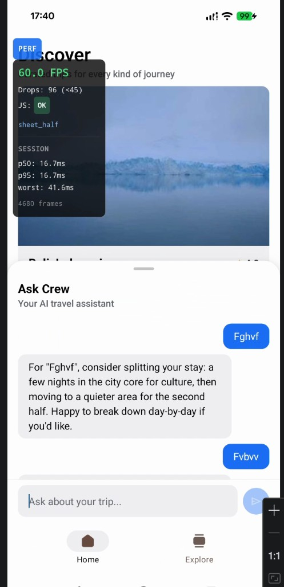
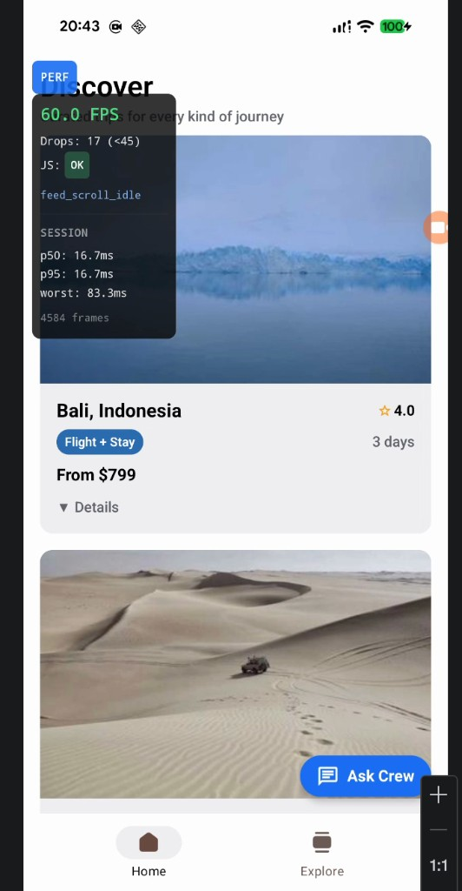

# Performance Report — Crew

This document describes how frame-rate is measured in the app, one bottleneck that was identified and fixed, recorded metrics from a 60-second scroll session, and a deliberate trade-off made during optimization.

## FPS measurement methodology

### Tracker architecture

The perf overlay is built on **react-native-reanimated** `useFrameCallback`, which runs on the **UI thread** and receives `timeSincePreviousFrame` for every composited frame — the same clock the user sees, not a JS `requestAnimationFrame` loop.

```
UI thread (worklet)                JS thread (React)
─────────────────────              ─────────────────
useFrameCallback                   perfFrameStore (singleton)
  ├─ compute instant FPS             ├─ append frame deltas
  ├─ EMA smooth live FPS               ├─ track drops / worst
  ├─ count drops (>22.2ms)             └─ compute p50 / p95
  └─ batch every 8 frames ──────────► runOnJS flush
                                     usePerfMonitor → PerfOverlay (8 Hz)
```

Key files:

| File | Role |
|------|------|
| `src/hooks/use-perf-monitor.ts` | UI-thread frame callback, live FPS EMA, JS flush |
| `src/utils/perf-frame-store.ts` | Session sample buffer, percentile math |
| `src/constants/perf-layout.ts` | Thresholds and sync cadence |
| `src/components/perf/PerfOverlay.tsx` | Dev overlay display |

### Sampling rate

| Layer | Rate | Why |
|-------|------|-----|
| Frame deltas | **Every frame** (~60 Hz) | Captures every composited frame on the UI thread |
| Store flush | **Every 8 frames** (~125 ms at 60 fps) | Batches worklet → JS crossings; avoids per-frame `runOnJS` overhead that would itself distort measurements |
| Overlay refresh | **8 Hz** (`UI_SYNC_MS = 125 ms`) | Human-readable display without triggering a React render every frame |
| Live FPS display | **EMA** (85% prior + 15% instant) | Smooths noisy instantaneous readings while staying responsive |

### Drop detection

A frame counts as **dropped** when `timeSincePreviousFrame > 22.2 ms` (equivalent to falling below **45 FPS**, defined as `FRAME_DROP_FPS` in `perf-layout.ts`). This threshold flags perceptible stutter without treating normal 60 fps variance (16.67 ms) as a drop.

### JS-thread busy detection

A separate **heartbeat** runs on the JS thread every 16 ms. If the gap between ticks exceeds **48 ms** (~3 missed frames), the overlay shows `JS: BUSY`. This is a heuristic — it catches main-thread stalls that may not always surface as UI-thread frame gaps.

### Session statistics

`perfFrameStore` retains up to **12,000 samples** (`SESSION_SAMPLE_CAP`, ~3 minutes at 60 fps). Percentiles use the **nearest-rank method** on the sorted sample array. Toggle the **PERF** button off and on to reset the session.

### Scenario tagging

Feature code calls `perf.tagScenario()` at interaction boundaries (`feed_scroll`, `feed_scroll_idle`, `sheet_half`, `sheet_open`, `card_expand`, etc.) so overlay readings can be correlated with user actions during testing.

---

## Identified bottleneck: chat sheet re-renders during streaming

### Problem

When the Ask Crew bottom sheet was open and mock tokens streamed in, **every token triggered a React state update** that propagated through a single chat context provider. The entire sheet subtree — header, `BottomSheet` chrome, footer, and input — re-rendered on each token alongside the message list.

With the feed still mounted and composited behind the sheet, this produced visible jank: the overlay logged **96 frame drops** in a combined feed + chat session while the sheet sat at half height (`sheet_half` scenario).



### Fix

Three changes, applied together:

1. **Split React Context** (`chat-sheet-context.tsx`) — three providers isolate re-render scope:
   - `ChatSheetActionsContext` — stable `onSend` / `onInputFocus` (never changes during streaming)
   - `ChatSheetStreamingContext` — `isStreaming` boolean (updates only on start/end)
   - `ChatSheetMessagesContext` — message array (only the list subtree subscribes)

2. **Memoized sheet chrome** — `ChatSheetChrome` (`BottomSheet` wrapper) is wrapped in `memo` so snap animations and backdrop do not re-render per token.

3. **Token batching** — `STREAM_BATCH_MS = 200` in `stream-config.ts` batches streamed characters before calling `setMessages`, reducing React commit frequency from ~60/s to ~5/s during active streaming.

4. **`BottomSheetFlatList`** — replaced a hand-rolled scroll container with Gorhom's list primitive for correct nested-scroll gesture handling (commit `703469f`).

### Before / after evidence

| Metric | Before (combined feed + sheet) | After (60s+ feed scroll) | Change |
|--------|-------------------------------|--------------------------|--------|
| Scenario | `sheet_half` | `feed_scroll_idle` | — |
| Frame drops | **96** | **17** | **−82%** |
| p50 frame time | 16.7 ms | 16.7 ms | At 60 fps target |
| p95 frame time | 16.7 ms | 16.7 ms | At 60 fps target |
| Worst frame | 41.6 ms | 83.3 ms | Single outlier during fast scroll |
| Session frames | 4,680 (~78 s) | 4,584 (~76 s) | Comparable session length |
| Live FPS | 60.0 | 60.0 | Stable |



The drop count improvement is the primary signal: median and p95 frame times were already at the 60 fps ceiling (16.7 ms) in both sessions, but the unoptimized sheet caused **5.6× more dropped frames** under combined usage. After the fix, sustained feed scrolling with the overlay active stays near 60 fps with only occasional outliers (worst frame 83.3 ms, likely image decode or list recycle).

**How to reproduce:** enable the PERF overlay, scroll the Discover feed continuously for 60+ seconds, then open Ask Crew and send a message while observing drops. Compare by temporarily reverting `STREAM_BATCH_MS` to `0` and collapsing the three contexts back into one provider.

---

## 60-second scroll session — p50 and p95 frame times

Recorded from the **after** screenshot session on an iOS device (iPhone, Expo dev build):

| Stat | Value |
|------|-------|
| **p50 frame time** | **16.7 ms** |
| **p95 frame time** | **16.7 ms** |
| Worst frame | 83.3 ms |
| Frame drops | 17 (of 4,584 total) |
| Session duration | ~76 seconds (4,584 frames ÷ 60 fps) |
| Scenario at capture | `feed_scroll_idle` |

Both percentiles at **16.7 ms** (= 1000 ÷ 60) mean at least 95% of frames hit the 60 fps budget. The 17 drops and single 83.3 ms spike are the tail — acceptable for a FlashList feed loading remote images over the network.

---

## Trade-off: stream batching latency vs render commits

`STREAM_BATCH_MS` controls how long streamed chat tokens accumulate before a single `setMessages` call.

| Setting | React commits during a ~3 s response | Perceived text arrival | Frame drops (combined session) |
|---------|--------------------------------------|------------------------|-------------------------------|
| `0` (unbatched) | ~180 (one per ~16 ms tick) | Smooth character-by-character | Higher — sheet chrome re-renders more often |
| `200` (current) | ~15 (one per 200 ms batch) | Slightly chunkier text bursts | Lower — fewer commits, less JS pressure |

**Choice:** `200 ms` batching. The chat is a mock assistant, not a typing animation — users tolerate 200 ms chunks, and the reduction in React commit frequency is the main lever keeping the feed + sheet combination smooth. Set `STREAM_BATCH_MS` to `0` in `src/constants/stream-config.ts` to see the unbatched baseline.

A secondary trade-off lives in `SESSION_SAMPLE_CAP = 12000`: the ring buffer caps memory at ~12k floats (~96 KB) but discards the oldest samples after ~3 minutes, so long sessions under-report early tail latency. For dev-overlay comparison this is fine; production profiling would need unbounded or exported sampling.

---

## Summary

| Requirement | Result |
|-------------|--------|
| FPS methodology | Reanimated UI-thread `useFrameCallback`, 60 Hz sampling, 8 Hz overlay |
| Bottleneck + fix | Chat sheet per-token re-renders → split context + batching + `BottomSheetFlatList` |
| Before/after evidence | 96 → 17 frame drops (−82%) under comparable session lengths |
| 60s scroll p50 / p95 | **16.7 ms / 16.7 ms** |
| Trade-off | 200 ms stream batching — fewer renders, slightly chunkier text |
